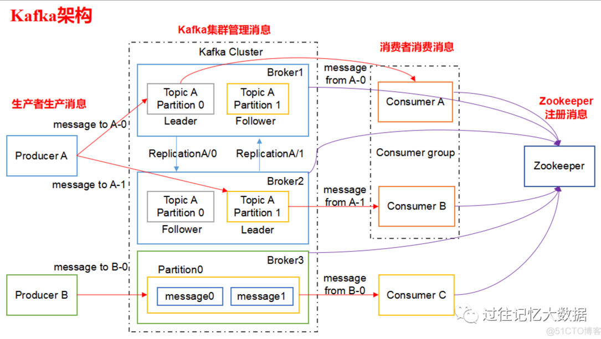
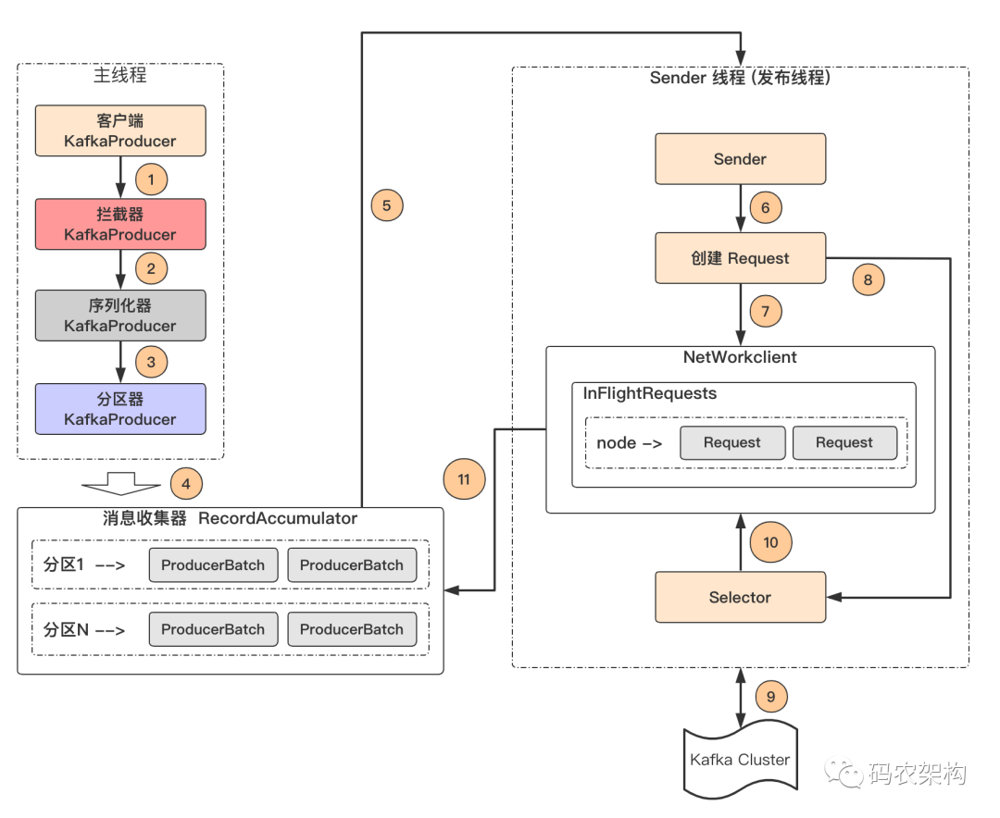
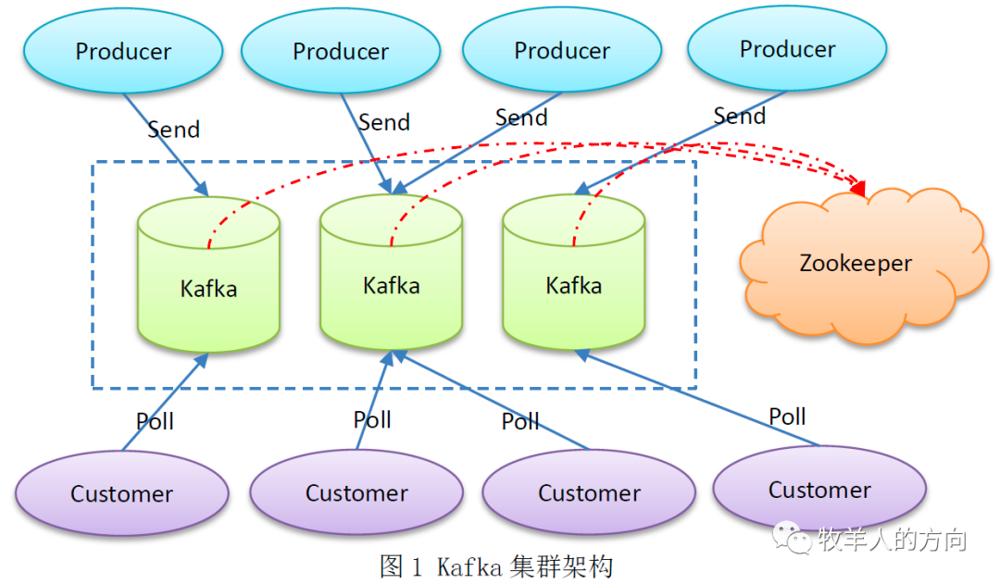

# 中间件
了解一些中间件的使用及原理：
## 1. MQ的分类和选型
### **1. ActiveMQ**

Apache下的一个子项目。使用Java完全支持JMS1.1和J2EE 1.4规范的 JMS Provider实现，少量代码就可以高效地实现高级应用场景。

**优点**：

- 单机吞吐量： 万级。
- 时效性： ms级。
- 可用性：高。
- 消息可靠性：较低概率出现丢失数据。

**缺点**官方社区现在对于 ActiveMQ 5.x的版本维护越来越少，高吞吐量场景较少使用。

### **2. Kafka**

Apache下的一个子项目，使用scala实现的一个高性能分布式Publish/Subscribe消息队列系统。尤其在大数据上是个杀手锏，吞吐量在百万级，在数据采集、传输、存储的过程中发挥举足轻重的作用。

**优点**

- 单机吞吐量： 百万级。
- 时效性： ms级。
- 可用性：非常高。
- 消息可靠性：可配置 0 丢失。
- 分布式：一个数据有多个副本，少数机器宕机也不会丢失数据。

**缺点**

- 单机超过64个队列/分区，CPU会明显变高，队列越多越高，发送消息响应时间变长。
- 消费失败不支持重试。

Kafka主要特点是基于PULL的模式来处理消息消费，追求高吞吐量，一开始的目的就是用于日志收集和传输，适合产生大量数据的互联网服务的数据收集业务。

### **3. RocketMQ**

阿里系下开源的一款分布式、队列模型的消息中间件，是阿里参照kafka设计思想使用java实现的一套MQ，并做了自己的改进。被阿里广泛的应用在订单、交易、充值、流计算、消息推送、日志流处理等场景。

**优点**

- 单机吞吐量： 十万级。
- 时效性： ms级。
- 可用性：非常高。
- 消息可靠性：可配置 0 丢失。
- 分布式：支持。
- 扩展性好，支持10亿级别的消息堆积。
- 源码是java，有利于定制。

**缺点**支持的语言不多，主要是java，C++还不成熟。社区活跃也一般，没有在 MQ 核心中实现 JMS 等接口，有些系统需要迁移则要修改大量代码。

RocketMQ 天生为了金融互联网而生，对于可靠性要求很高的场景，比如电商里的扣款，它更值得信赖。

### **4. RabbitMQ**

使用Erlang编写的一个开源的消息队列，本身支持很多的协议：AMQP，XMPP, SMTP,STOMP，也正是如此，使的它变的非常重量级，更适合于企业级的开发。

**优点**

- 单机吞吐量： 万级。
- 时效性：μs级。
- 可用性：高。
- 消息可靠性：基本不丢失。
- 支持多语言。
- 社区活跃度高，更新频率高

**缺点**商业版需要付费，学习成本较高。

RabbitMQ 性能好，时效性强，管理界面也很友好。如果数据量没那么大，中心型业务可以优先选择功能完备的 RabbitMQ。

## 2. Kafka 整体架构


### 1. 分区的作用，分区的实现是怎么实现的？
Kafka的消息通过主题进行分类。主题就好比数据库的表，或者文件系统里的文件夹。主题可以被分为若干个分区，一个分区就是一个提交日志。消息以追加的方式写入分区，然后以先入先出的顺序读取。

Kafka 为一个 Partition 生成多个副本，并且把它们分散在不同的 Broker。
如果一个 Broker 故障了，Consumer 可以在其他 Broker 上找到 Partition 的副本，继续获取消息。即 Partition 为 Kafka 提供了数据冗余。

当一条记录写入 Partition 的时候，它就被追加到 log 文件的末尾，并被分配一个序号，作为 Offset。

### 2. 分区器、序列化器、拦截器，它们的顺序
客户端架构图


生产者拦截器和消费者拦截器：生产者拦截器有两个方面的作用，既可以用来在消息发送前做一些预处理工作，比如给消息添加前缀内容等；也可以用来在发送回调逻辑前做一些定制化的工作，比如统计成功率等。
```java
public interface ProducerInterceptor<K, V> extends Configurable {
    // 该方法会在消息发送之前被调用
    ProducerRecord<K, V> onSend(ProducerRecord<K, V> record);
    // 该方法会在消息成功提交或发送失败之后被调用
    void onAcknowledgement(RecordMetadata metadata, Exception exception);
    // 关闭interceptor，主要用于执行一些资源清理工作
    void close();
}
```

序列化器：生产者需要将消息对象进行序列化成为字节数，才能通过网络发送给kafka服务端，而在消费者端也需要使用反序列化器将收到的字节数转换为相应的消息对象。建议使用已有的序列化器和反序列化器，比如JSON、Avro、Thrift或Protobuf。

分区器：

KafkaProducer在调用send()方法发送消息到broker服务端过程中，首先经过拦截器Interceptor（不是必须）、序列化器Serializer（必须），然后就到分区器Partitioner。如果消息ProducerRecord中指定了partition字段，那么就不需要分区器来处理，因为partition代表的就是所要发往的分区号；如果没有指定，则需要分区器进行分配。

```java
public interface Partitioner extends Configurable, Closeable {    
	//计算分区号    
	int partition(String topic, Object key, byte[] keyBytes, Object value, byte[] valueBytes, Cluster cluster);    
	//表示通知分区程序用来创建新的批次。    
	void close();    
	//表示通知分区程序用来创建新的批次    
	default void onNewBatch(String topic, Cluster cluster, int prevPartition) {    }
}
```

### 3. 重复消费和漏消费，客户端和服务端都是怎么解决的？
如果消费者发生崩溃或者有新的消费者加入群组，就会触发再均衡，完成再均衡之后，每个消费者可能分配到新的分区，而不是之前处理的那个。为了能够继续之前的工作，消费者需要读取每个分区最后一次提交的偏移量，然后从偏移量指定的地方继续处理。
- 如果提交的偏移量小于客户端处理的最后一个消息的偏移量，那么处于两个偏移量之间的消息就会被重复处理。
- 如果提交的偏移量大于客户端处理的最后一个消息的偏移量，那么处于两个偏移量之间的消息将会丢失。

解决方式：
1. 自动提交
最简单的提交方式是让消费者自动提交偏移量。如果enable.auto.commit被设为true，那么每过5s，消费者会自动把从poll()方法接收到的最大偏移量提交上去。

问题：假设我们仍然使用默认的5s提交时间间隔，在最近一次提交之后的3s发生了再均衡，再均衡之后，消费者从最后一次提交的偏移量位置开始读取消息。这个时候偏移量已经落后了3s，所以在这3s内到达的消息会被重复处理。可以通过修改提交时间间隔来更频繁地提交偏移量，减小可能出现重复消息的时间窗，不过这种情况是无法完全避免的。
2. 手动提交当前偏移量
开发者可以在必要的时候提交当前偏移量，而不是基于时间间隔。

3. 异步提交
手动提交有一个不足之处，在broker对提交请求作出回应之前，应用程序会一直阻塞，这样会限制应用程序的吞吐量。我们可以通过降低提交频率来提升吞吐量，但如果发生了再均衡，会增加重复消息的数量。这个时候可以使用异步提交API。我们只管发送提交请求，无需等待broker的响应。

问题：假设我们发出一个请求用于提交偏移量2000，这个时候发生了短暂的通信问题，服务器收不到请求，自然也不会作出任何响应。与此同时，我们处理了另外一批消息，并成功提交了偏移量3000。如果commitAsync()重新尝试提交偏移量2000，它有可能在偏移量3000之后提交成功。这个时候如果发生再均衡，就会出现重复消息。

解决：我们可以使用一个单调递增的序列号来维护异步提交的顺序。在每次提交偏移量之后或在回调里提交偏移量时递增序列号。在进行重试前，先检查回调的序列号和即将提交的偏移量是否相等，如果相等，说明没有新的提交，那么可以安全地进行重试。如果序列号比较大，说明有一个新的提交已经发送出去了，应该停止重试。

Kafka的保证机制有几个方面：

- Kafka可以保证分区消息的顺序。如果使用同一个生产者往同一个分区写入消息，而且消息B在消息A之后写入，那么Kafka可以保证消息B的偏移量比消息A的偏移量大，而且消费者会先读取消息A再读取消息B。
- 只有当消息被写入分区的所有同步副本时（但不一定要写入磁盘），它才被认为是“已提交”的。生产者可以选择接收不同类型的确认，比如在消息被完全提交时的确认，或者在消息被写入首领副本时的确认，或者在消息被发送到网络时的确认。
- 只要还有一个副本是活跃的，那么已经提交的消息就不会丢失。
- 消费者只能读取已经提交的消息。

### 4. kafka 为什么性能这么好，怎么实现的
性能好的原因：

1. **零拷贝（通过两种零拷贝技术：mmap和sendfile）**
2. **顺序读写**
3. **PageCache**
4. **批量操作**
5. **数据压缩**

### 5. kafka集群
kafka集群架构

需要多少个broker

一个Kafka集群需要多少个broker取决于以下几个因素。

首先，需要多少磁盘空间来保留数据，以及单个broker有多少空间可用。如果整个集群需要保留10TB的数据，每个broker可以存储2TB，那么至少需要5个broker。如果启用了数据复制，那么至少还需要一倍的空间，不过这要取决于配置的复制系数是多少。也就是说，如果启用了数据复制，那么这个集群至少需要10个broker。

第二个要考虑的因素是集群处理请求的能力。这通常与网络接口处理客户端流量的能力有关，特别是当有多个消费者存在或者在数据保留期间流量发生波动（比如高峰时段的流量爆发）时。如果单个broker的网络接口在高峰时段可以达到80%的使用量，并且有两个消费者，那么消费者就无法保持峰值，除非有两个broker。如果集群启用了复制功能，则要把这个额外的消费者考虑在内。因磁盘吞吐量低和系统内存不足造成的性能问题，也可以通过扩展多个broker来解决。

broker配置

要把一个broker加入到集群里，只需要修改两个配置参数。

首先，所有broker都必须配置相同的zookeeper.connect，该参数指定了用于保存元数据的Zookeeper群组和路径。

其次，每个broker都必须为broker.id参数设置唯一的值。如果两个broker使用相同的[broker.id](http://broker.id/)，那么第二个broker就无法启动。在运行集群时，还可以配置其他一些参数，特别是那些用于控制数据复制的参数，这些将在后续的章节介绍。

# 3. RabbitMQ
